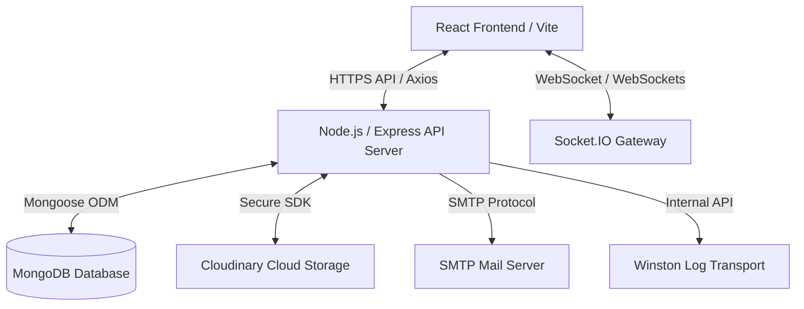
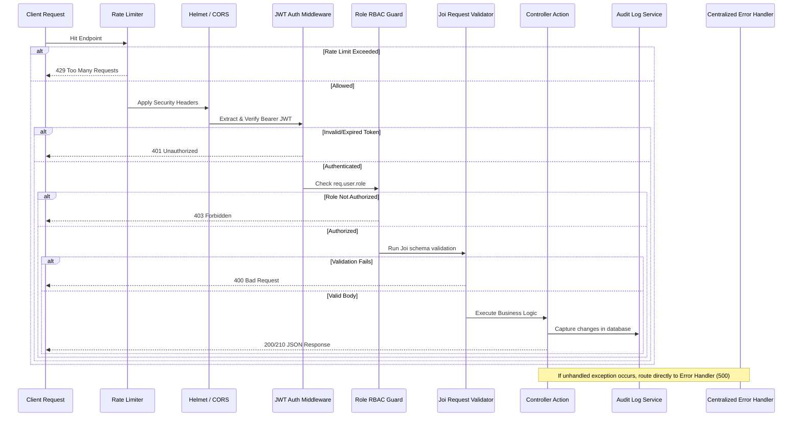

# PulseCare - Enterprise AI-Powered Hospital Portal

PulseCare is a production-grade, state-of-the-art Hospital Management System (HMS) built on a MERN stack. It features robust Role-Based Access Control (RBAC) across 9 roles, a longitudinal Electronic Medical Record (EMR) system, a real-time Emergency Department triage dashboard, clinical workflows, and advanced AI-powered assistant services.

---

## 1. System Architecture

PulseCare is designed with a decoupled architecture containing a React client, an Express backend API, Socket.IO real-time channels, and MongoDB database storage.

### 1.1 Component Overview


### 1.2 Entity Relationship Diagram (ERD)
```mermaid
erDiagram
    User ||--o| Patient : "associates to patient profile"
    User ||--o{ RefreshToken : "owns"
    User ||--o{ Appointment : "manages/creates (as Physician)"
    Patient ||--o{ EMR : "has medical history"
    Patient ||--o{ Appointment : "schedules"
    User ||--o{ EMR : "creates record (as Provider)"
    User ||--o{ AuditLog : "triggers events"
    User ||--o{ Notification : "receives alerts"
    DoctorAvailability ||--|| User : "belongs to Doctor"

    User {
        ObjectId _id PK
        string email UNIQUE
        string passwordHash
        string firstName
        string lastName
        string role ENUM
        boolean isActive
    }

    RefreshToken {
        ObjectId _id PK
        ObjectId userId FK
        string token UNIQUE
        date expiresAt
        boolean isRevoked
        string replacedByToken
    }

    Patient {
        ObjectId _id PK
        string patientId UNIQUE
        ObjectId userId FK
        string firstName
        string lastName
        date dateOfBirth
        string gender
        string contactNumber
        object emergencyContact
        string bloodGroup
        string allergies
    }

    EMR {
        ObjectId _id PK
        ObjectId patientId FK
        ObjectId providerId FK
        date encounterDate
        object vitals
        string clinicalNotes
        array diagnoses
        array prescriptions
        array attachments
    }

    Appointment {
        ObjectId _id PK
        ObjectId patientId FK
        ObjectId doctorId FK
        date appointmentDate
        object slot
        string reason
        string status ENUM
    }

    DoctorAvailability {
        ObjectId _id PK
        ObjectId doctorId FK
        string dayOfWeek ENUM
        array slots
        array exceptions
    }

    AuditLog {
        ObjectId _id PK
        ObjectId userId FK
        string action
        string resource
        string resourceId
        string ipAddress
        string userAgent
        object changes
        date timestamp
    }
```

### 1.3 Request-Response Middleware Stack


---

## 2. Seeded Test Credentials

The database seeding process generates accounts for each of the 9 roles with specific permission profiles.

| Role | Email | Password | Allowed Dashboards & Modules |
| :--- | :--- | :--- | :--- |
| **Super Admin** | `superadmin@hms.com` | `SuperAdmin123!` | All Admin Controls, Analytics, Operational AI, Audits, Bed Grid, EMR |
| **Hospital Admin** | `admin@hms.com` | `Admin123!` | User Management, Patients, Appointments, Rooms, ER, EMR, Billing |
| **Doctor** | `doctor@hms.com` | `Doctor123!` | Consultation Queue, SOAP notes, Lab Requests, EMR, Pharmacy Read |
| **Nurse** | `nurse@hms.com` | `Nurse123!` | Demographic Intake, Vitals EMR, Room Allocation, Emergency Bedding |
| **Receptionist** | `receptionist@hms.com` | `Receptionist123!`| Demographics Intake, Appointments Booking, Bed grid overview |
| **Lab Technician** | `labtech@hms.com` | `Labtech123!` | Diagnostic Queue, Sample processing, Reports upload, EMR Attachment |
| **Pharmacist** | `pharmacist@hms.com` | `Pharmacist123!` | Dispensary queue, Stock directory, AI Pill Explainer, EMR Read |
| **Billing Executive**| `billing@hms.com` | `Billing123!` | Invoices compiler, custom charges list, Revenue ledger, Logs |
| **Patient** | `patient@hms.com` | `Patient123!` | Profile demographic update, My EMR, Appt Booking, AI Symptom, Payments |

---

## 3. Step-by-Step Setup Guide

Follow these instructions to configure, seed, and run PulseCare on your local system.

### Prerequisites
- **Node.js** (v18 or higher)
- **MongoDB** (v6 or higher, running locally on port 27017 or a MongoDB Atlas URI)

---

### 3.1 Local Environment Configuration

Create a `.env` file inside the `backend/` directory based on the `.env.example` template:

```env
PORT=5050
NODE_ENV=development
MONGODB_URI=mongodb://localhost:27017/hms_db
ACCESS_TOKEN_SECRET=dev_access_secret_key_9988776655
REFRESH_TOKEN_SECRET=dev_refresh_secret_key_1122334455
ACCESS_TOKEN_EXPIRY=15m
REFRESH_TOKEN_EXPIRY=7d
ALLOWED_CLIENT_ORIGIN=http://localhost:5173

# Optional: Cloud Storage for EMR attachments (local fallback used if left blank)
CLOUDINARY_CLOUD_NAME=
CLOUDINARY_API_KEY=
CLOUDINARY_API_SECRET=

# Optional: Mail configuration (Ethereal fallback defaults used if left blank)
SMTP_HOST=smtp.ethereal.email
SMTP_PORT=587
SMTP_USER=
SMTP_PASS=
SMTP_FROM=hms-alerts@hospital.com

DEFAULT_SUPERADMIN_EMAIL=superadmin@hms.com
DEFAULT_SUPERADMIN_PASSWORD=SuperAdmin123!
```

---

### 3.2 Installation & Seeding

1. **Install Backend Dependencies:**
   ```bash
   cd backend
   npm install
   ```

2. **Seed the Database:**
   Ensure your local MongoDB instance is active, then run:
   ```bash
   npm run seed
   ```

3. **Install Frontend Dependencies:**
   ```bash
   cd ../frontend
   npm install
   ```

---

### 3.3 Running Development Servers

Start the servers side-by-side:

1. **Start Backend API Server (on Port 5050):**
   ```bash
   cd backend
   npm run dev
   ```

2. **Start Frontend Client Server (on Port 5173):**
   ```bash
   cd frontend
   npm run dev
   ```

Once started, open your browser and navigate to: **[http://localhost:5173/](http://localhost:5173/)**

---

### 3.4 Running via Docker Compose

PulseCare is containerized and can be launched entirely via Docker Compose:

1. Ensure Docker Desktop is active.
2. From the root directory, run:
   ```bash
   docker-compose up --build
   ```
This will build and configure the frontend, backend, and a database instance automatically. Access the app on **[http://localhost/](http://localhost/)** (Port 80).

---

## 4. Key Functional Modules

- **Core Security & RTR:** JWT Access tokens expire in 15 minutes, with automatic token rotation using secure HTTP-only cookies. Replay-attacks on rotated tokens trigger automatic session termination across all devices.
- **Patient Registry Intake:** Generates patient profiles with structured alphanumeric IDs `PT-YYYYMMDD-XXXX`.
- **EMR Timeline:** Longitudinal medical record charts with vitals tracking, ICD-10 diagnoses search patterns, and Cloudinary diagnostic scan attachments.
- **Appointments Command Center:** Booking dialogs matching patient/doctor schedules, with default fallback slots (`09:00`, `10:00`, `14:00`) for seamless setup.
- **Emergency Room Command:** Color-coded triage system (Red, Yellow, Green) for immediate ICU/bed assignment and live emergency status transitions.
- **AI-Powered Diagnostics:** Custom local rules engine & LLM assistants:
  - *Symptom Analyzer:* Identifies urgency and matches relevant hospital departments.
  - *Pill Explainer:* Breaks down warnings, side effects, and dosage info.
  - *Chat Concierge:* Multi-turn assistant that matches text query strings to doctors and available booking slots.
- **Invoices & Billing checkout:** Financial checkout module compiles unpaid consultations, pharmacy prescriptions, and lab tests into a single invoice. Includes a mock checkout terminal.
- **Compliance Audit logs:** Tracks modifications, logins, and EMR views with before-and-after state differences.
